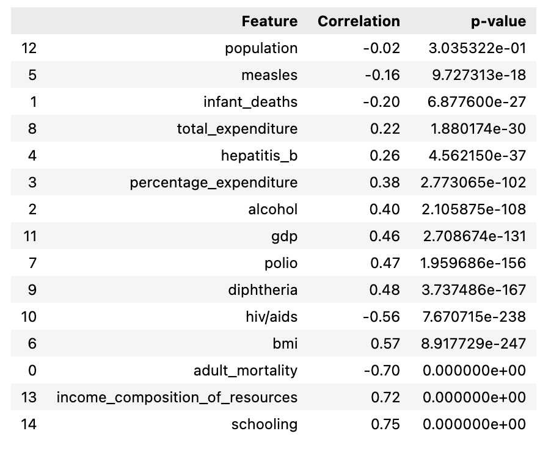

# MATH4581 Project

**Name**: Juan Aguilar

**Date**: April 24, 2023

For this project, the aim is to determine how different attributes can correlate with life expectancy in different countries. I aim to determine which of the many health factors has the highest correlation with life expectancy. After obtaining the three (3) factors with the highest correlation, I will perform linear regression, and determine if the line of best fit is statistically significant. Afterwards, I will determine the confidence interval. 
## Steps
First, I imported the dataset aquired from Kaggle.com. The dataset contains life expectancy values from the WHO along with othetr factors that may influence a country's life expectancy. 

After cleaning and preparing the data, I determined the correlation value for each factor with respect to life expectancy. 

Afterwards, I determined that the three factors with the highest (absolute) correlation factors were adult morality, income composition of resources, and schooling. 
These factors are defined below. 
- Adult morality - probability of dying between 15 and 60 years per 1000 population
- Income Composition of Resources - Human Development Index in terms of income composition of resources (index ranging from 0 to 1)
- Schooling - Number of years of Schooling(years)

After obtaining the three health factors with the highest correlation factor, I used Scipy's LinearRegression library (linregress) to calculate the intercept, slope, and p-value of the regression line for each factor.

## Results
| Health Factor | Correlation Factor | Slope | Intercept | p-value | Linear Regression Test Conclusion
|---|---|---|---|----|---|
| Schooling | 0.75 | 2.10 | 44.11 | 0.00 | Reject null hypothesis |
| Adult Mortality | -0.70 | -0.05 | 78.02 | 0.00 | Reject null hypothesis|
|Income Composition of Resources | 0.72 | 32.16 | 49.17 | 0.00 | Reject null hypothesis|

### Correlation Factors
- Schooling has a correlation factor of 0.75, which means it has a relatively strong positive correlation with life expectancy. 
- Adult Mortality has a correlation factor of -0.70, which means it has a relatively strong negative correlation with life expectancy.
- Income composition of resources has a correlation factor of 0.72, which emans it has a relatively high positive correlation with life expectancy.

### Lines of linear regression
 - Schooling : $y = 44.11 + 2.10x$, where y is life expectancy in years, and x is number of years of schooling
 - Adult Mortality : $y = 78.02 + 2.10x$, where y is life expectancy in years, and x is the probability of dying between 15 and 60 years per 1000 population.
 - Income composition of resources : $y = 49.17 + 32.16x, where where y is life expectancy in years, and x is the Human Development Index in terms of income composition of resources.

### Statisical Significance
- For all of the attributes, the p-value is 0 (or close to 0), which is below 5%. This means that each regression line is statiscaly significant and we can reject the null hypothesis.

